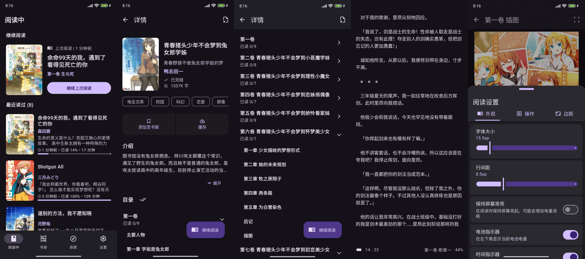
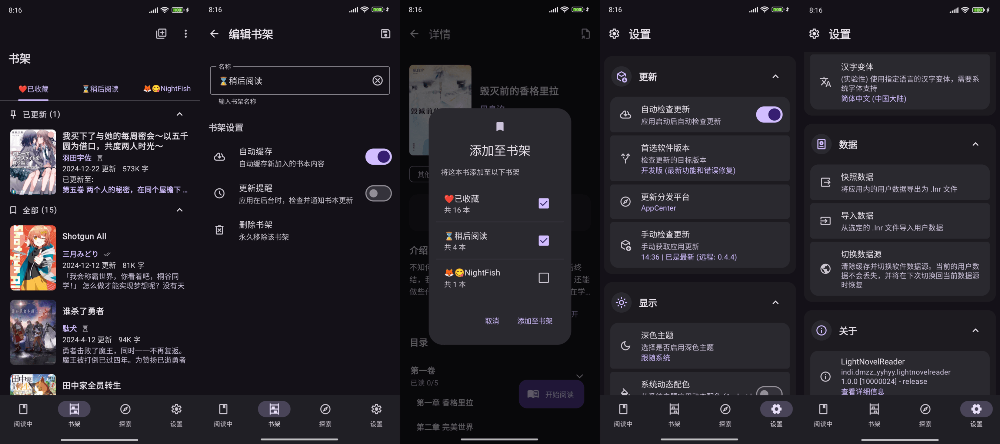

<div align="center">
    <h1>LightNovelReader</h1>
    <a></a>
    <a></a>
    <a></a>
    <a href="http://qm.qq.com/cgi-bin/qm/qr?_wv=1027&k=P__gXIArh5UDBsEq7ttd4WhIYnNh3y1t&authKey=GAsRKEZ%2FwHpzRv19hNJsDnknOc86lYzNIHMPy2Jxt3S3U8f90qestOd760IAj%2F3l&noverify=0&group_code=867785526"></a>
    <p>轻小说阅读软件，使用 Jetpack Compose 框架编写</p>
    
</div>

## 介绍

LightNovelReader <sup>*重构版*</sup> 是一款开源的轻小说阅读软件，使用 Kotlin 和 Jetpack Compose 编写，提供轻量化的体积和流畅的阅读体验。

查看重构前的 [分支](https://github.com/dmzz-yyhyy/LightNovelReader/tree/master)

## 下载

软件处于开发阶段，要体验最新的功能与 Bug 修复，我们推荐使用 [Actions](https://github.com/dmzz-yyhyy/LightNovelReader/actions) 内的最新构建，或从 [GitHub Releases](https://github.com/dmzz-yyhyy/LightNovelReader/releases/latest) 下载最新发布版

## 支持

- 在 [**此处**](https://github.com/dmzz-yyhyy/LightNovelReader/issues/new/choose) 提交一个 Bug 反馈或新功能请求
- 欢迎加入 QQ 讨论群：`867785526` | [**邀请链接**](http://qm.qq.com/cgi-bin/qm/qr?_wv=1027&k=P__gXIArh5UDBsEq7ttd4WhIYnNh3y1t&authKey=GAsRKEZ%2FwHpzRv19hNJsDnknOc86lYzNIHMPy2Jxt3S3U8f90qestOd760IAj%2F3l&noverify=0&group_code=867785526)

## 软件截图

|                             |
|-----------------------------|
|  |
|   |
|  |
|   |
|  |
|   |

### EpubLib
为了处理epub的导出问题，我们单独创建了一个epub处理模块，如果您感兴趣，可以看[**这里**](https://github.com/dmzz-yyhyy/LightNovelReader/blob/refactoring/epub.md)

## License

```
Copyright (C) 2024 by NightFish <hk198580666@outlook.com>
Copyright (C) 2024 by yukonisen <yukonisen@curiousers.org>

This program is free software: you can redistribute it and/or modify
it under the terms of the GNU General Public License as published by
the Free Software Foundation, either version 3 of the License, or
(at your option) any later version.

This program is distributed in the hope that it will be useful,
but WITHOUT ANY WARRANTY; without even the implied warranty of
MERCHANTABILITY or FITNESS FOR A PARTICULAR PURPOSE.  See the
GNU General Public License for more details.

You should have received a copy of the GNU General Public License
along with this program. If not, see <http://www.gnu.org/licenses/>.
```