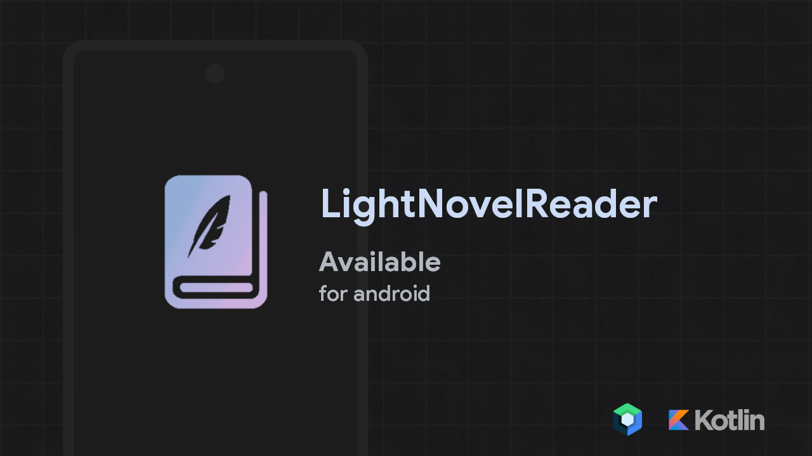
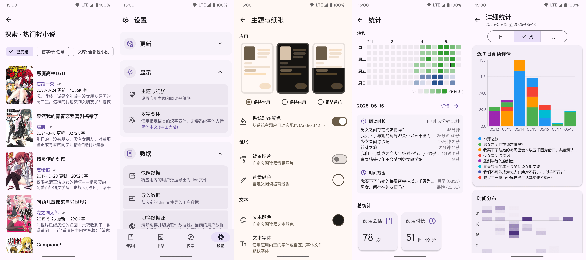

[简体中文](README.md) | **繁體中文** | [English](README_US.md) | [Русский](README_RU.md)

<div align="center">
    <h1>LightNovelReader</h1>
    <a></a>
    <a></a>
    <a></a>
    <a href="http://qm.qq.com/cgi-bin/qm/qr?_wv=1027&k=P__gXIArh5UDBsEq7ttd4WhIYnNh3y1t&authKey=GAsRKEZ%2FwHpzRv19hNJsDnknOc86lYzNIHMPy2Jxt3S3U8f90qestOd760IAj%2F3l&noverify=0&group_code=867785526"></a>
    <a href="https://discord.gg/pnf4ABmDJt"></a>
    <a href="https://t.me/lightnoble"></a>
    <p>輕小說閱讀軟體，使用 Jetpack Compose 框架開發</p>
    
</div>

## 介紹

LightNovelReader <sup>*重構版*</sup> 是一款開源的輕小說閱讀軟體，使用 Kotlin 和 Jetpack Compose 開發，具有輕量化的體積和流暢的閱讀體驗。此外，還有多種實用功能，如 EPUB 匯出、離線閱讀和多資料來源支援。

## 特色

- 完全重構的版本（可在[ 此處 ](https://github.com/dmzz-yyhyy/LightNovelReader/tree/master)查看重構前的分支）
- 使用 Jetpack Compose，提供流暢的閱讀體驗，支援 Android 7.0 ~ 15
- 快取－支援快取書本內容，以及離線優先的閱讀
- 探索－發現新書、推薦榜，標籤分類，關鍵字搜尋……
- 多資料來源支援－可以切換資料來源，甚至可以看漫畫。資料來源之間資料獨立
- 書架－完整的書架系統，支援建立和命名書架，將書本加入收藏、取得書本更新提示
- 將書本匯出為 EPUB 檔案
- 熱情的開發者，還有更多…

## 外掛程式開發與自訂資料來源

您可以為LightNovelReader新增自訂的資料來源與插件

您可以從[範例外掛程式](https://github.com/dmzz-yyhyy/LightNovelReaderPlguin-Template)開始

歡迎各位開發者進行開發!

## 下載

從 [GitHub Releases](https://github.com/dmzz-yyhyy/LightNovelReader/releases/latest) 下載最新發布版。要體驗最新的功能與錯誤修復，請從 [Actions](https://github.com/dmzz-yyhyy/LightNovelReader/actions) 下載最新建置。

## 支援

- 在 [**此處**](https://github.com/dmzz-yyhyy/LightNovelReader/issues/new/choose) 提交一個錯誤回報或新功能請求
- 歡迎加入 QQ 討論群：`867785526` | [**邀請連結**](http://qm.qq.com/cgi-bin/qm/qr?_wv=1027&k=P__gXIArh5UDBsEq7ttd4WhIYnNh3y1t&authKey=GAsRKEZ%2FwHpzRv19hNJsDnknOc86lYzNIHMPy2Jxt3S3U8f90qestOd760IAj%2F3l&noverify=0&group_code=867785526)
- 歡迎加入 Discord 伺服器：[**邀請連結**](https://discord.gg/pnf4ABmDJt)
- 歡迎加入 Telegram 討論群組：[**邀請連結**](https://t.me/lightnoble)

## 軟體截圖

|                             |
|-----------------------------|
|  |
|  |
|  |

### 關於 EpubLib

為了處理 epub 的匯出問題，我們單獨建立了一個 epub 處理模組，如果您感興趣，可以看[**這裡**](https://github.com/dmzz-yyhyy/LightNovelReader/blob/refactoring/epub.md)

## 貢獻

我們歡迎對 LightNovelReader 的貢獻！以下是如何參與：

### 開始
1. Fork 本倉庫。
2. 克隆你的 fork：`git clone https://github.com/your-username/LightNovelReader.git`
3. 為你的更改建立新分支：`git checkout -b feature/your-feature-name`
4. 進行更改並測試。
5. 依照下方提交指南提交變更。
6. 推送到你的 fork：`git push origin feature/your-feature-name`
7. 向 `refactoring` 分支開啟 Pull Request。

### 提交指南
- 保持提交原子化且描述清楚。
- 若你的變更會影響版本，請在 `app/build.gradle.kts` 中更新。

### 版本管理
版本在 `app/build.gradle.kts` 中管理：
- `versionName`：公開版本（例如 "1.3.1"）。遵循語義化版本（major.minor.patch）。
- `versionCode`：隨著開發自然遞增。
- 
## 支持專案

[](https://www.ifdian.net/a/lightnovelreader)

LightNovelReader 是一個完全免費、開源的專案。  
如果你喜歡這個專案，或它對你有所幫助，歡迎透過 [愛發電](https://www.ifdian.net/a/lightnovelreader) 贊助。
所有贊助款項將用於持續開發、新功能實作、（若有）伺服器維護及社群建設。
你的支持讓我們能不斷前進，打造更好的閱讀體驗。

## 授權條款

```
Copyright (C) 2024 by NightFish <hk198580666@outlook.com>
Copyright (C) 2024 by yukonisen <yukonisen@curiousers.org>

This program is free software: you can redistribute it and/or modify
it under the terms of the GNU General Public License as published by
the Free Software Foundation, either version 3 of the License, or
(at your option) any later version.

This program is distributed in the hope that it will be useful,
but WITHOUT ANY WARRANTY; without even the implied warranty of
MERCHANTABILITY or FITNESS FOR A PARTICULAR PURPOSE.  See the
GNU General Public License for more details.

You should have received a copy of the GNU General Public License
along with this program. If not, see <http://www.gnu.org/licenses/>.
```
